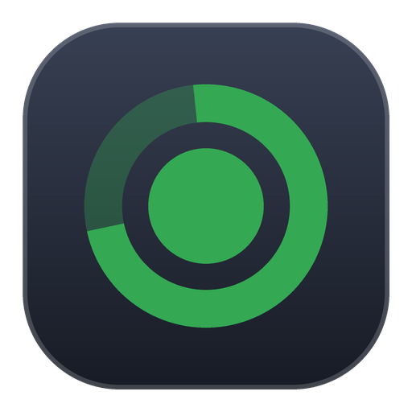
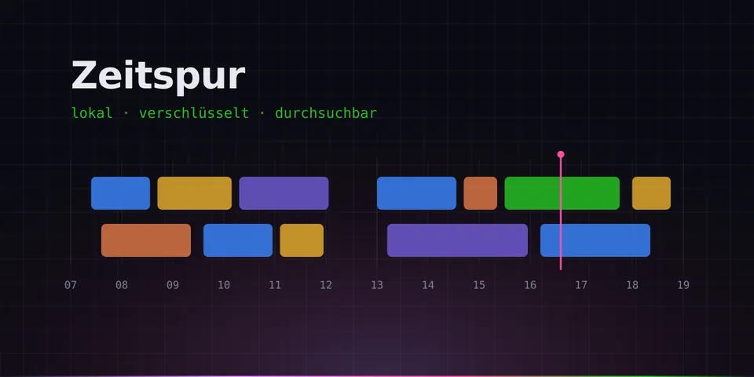
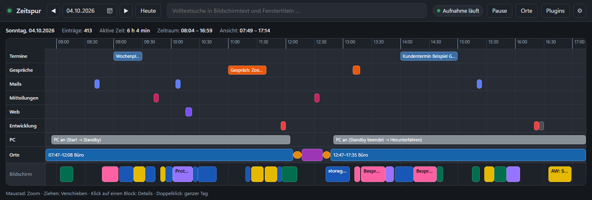
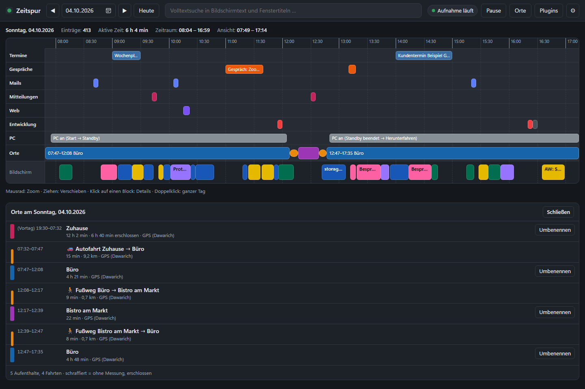
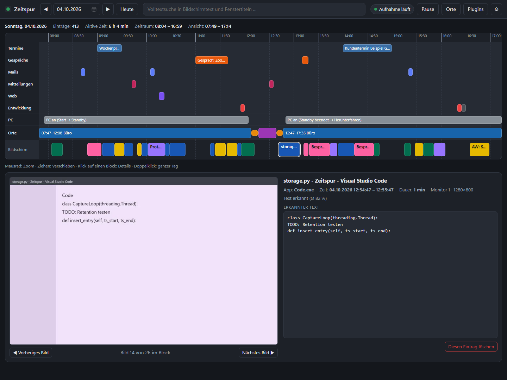
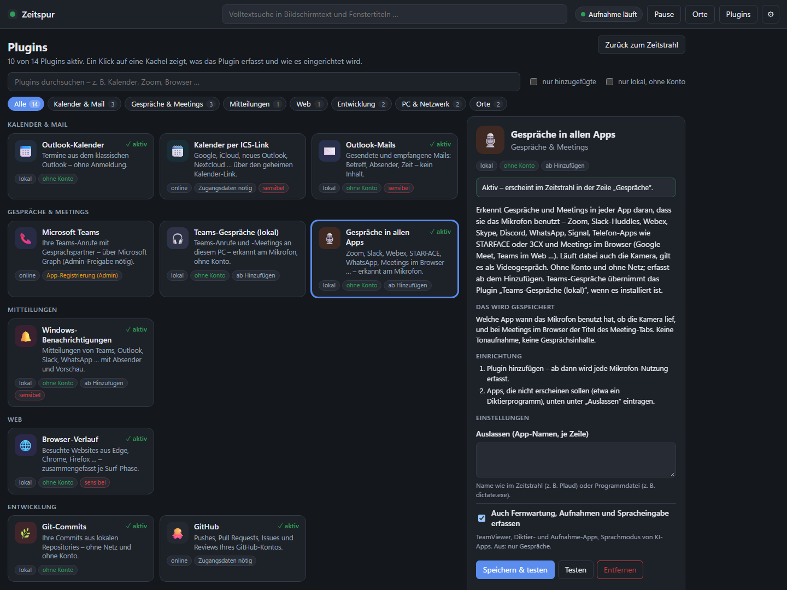
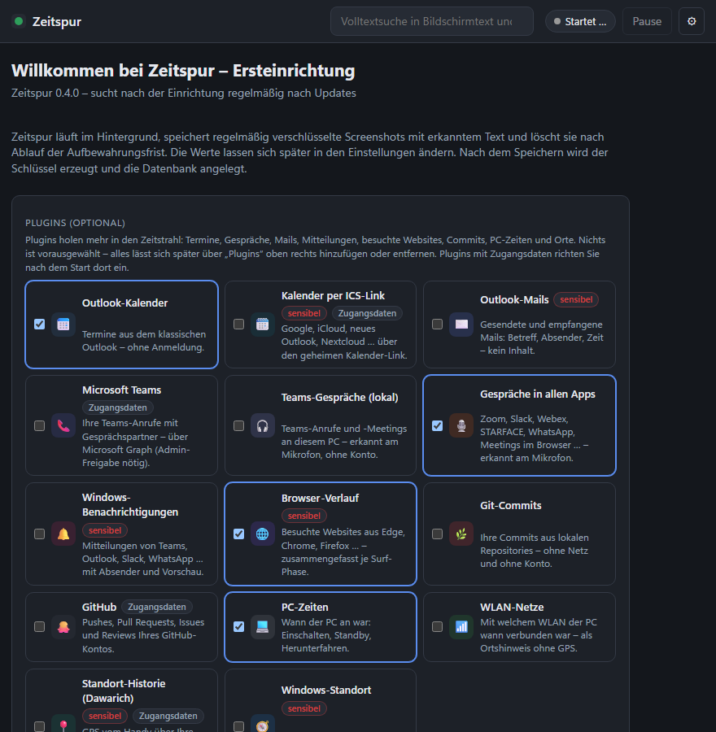
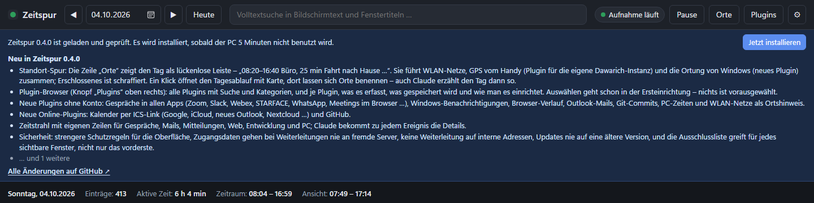

<p align="center">
  
</p>

<h1 align="center">Zeitspur</h1>

<p align="center">
  Ihr Arbeitstag als durchsuchbarer Zeitstrahl – lokal, verschlüsselt und mit Anbindung an Claude.
</p>

<p align="center">
  <a href="https://github.com/Tim-Schaller/Zeitspur/releases/latest"><b>Herunterladen</b></a> ·
  <a href="https://www.timschaller.de/de/projects/zeitspur/">Projektseite</a> ·
  <a href="#screenshots">Screenshots</a> ·
  <a href="#plugins">Plugins</a> ·
  <a href="CHANGELOG.md">Änderungen</a>
</p>

<p align="center">
  
</p>

Zeitspur ist ein lokaler, verschlüsselter Aktivitätsverlauf für Windows – nach dem Vorbild von „Windows Recall“:
Ein Tray-Dienst macht in regelmäßigen Abständen Screenshots aller Monitore, erkennt den sichtbaren Text per OCR
und speichert alles in **einer** AES-256-verschlüsselten SQLCipher-Datenbank. Ein Zeitstrahl-Fenster zeigt, was
wann geöffnet war; ein lokaler MCP-Server erlaubt Fragen wie „Was habe ich letzten Mittwoch um 12 Uhr gemacht?“
direkt in Claude. Nach 14 Tagen (konfigurierbar) werden Einträge automatisch gelöscht.

Alles bleibt auf dem Rechner. Es gibt keinen Netzwerkdienst, keinen offenen Port und keine Cloud.
Ausnahmen sind die Online-[Plugins](#plugins), die Sie ausdrücklich hinzufügen (Kalender per ICS-Link, GitHub, Teams, Standort-Historie – jeweils nur zu dem Dienst, den Sie eintragen), die standardmäßig ausgeschaltete Karte, die Kacheln von OpenStreetMap lädt, und die [Update-Prüfung](#updates) der Release-Ausgabe: Sie fragt bei GitHub nach, ob es eine neue Version gibt – von Ihren Daten wird dabei nichts übertragen. Alle anderen Plugins lesen nur, was ohnehin auf dem PC liegt.

## Inhalt

1. [Screenshots](#screenshots)
2. [Funktionsweise](#funktionsweise)
3. [Installation](#installation)
4. [Ersteinrichtung](#ersteinrichtung)
5. [Bedienung: Tray-Menü und Zeitstrahl](#bedienung-tray-menü-und-zeitstrahl)
6. [Konfiguration](#konfiguration)
7. [Claude anbinden (MCP-Server)](#claude-anbinden-mcp-server)
8. [Plugins](#plugins)
9. [Datenschutz und Sicherheit](#datenschutz-und-sicherheit)
10. [Performance und Speicherbedarf](#performance-und-speicherbedarf)
11. [Updates](#updates)
12. [Deinstallation](#deinstallation)
13. [Fehlerbehebung](#fehlerbehebung)
14. [Entwicklung und Build](#entwicklung-und-build)
15. [Lizenz](#lizenz)

## Screenshots

Alle Bilder zeigen die echte Oberfläche mit erfundenen Demo-Daten.

**Der Zeitstrahl eines Tages.** Oben stehen die Ereignisse der Plugins in eigenen Zeilen: Termine, Gespräche,
Mails, Mitteilungen, besuchte Websites, Commits, PC-Zeiten und Orte. Darunter liegt die Bildschirmaktivität,
ein Block je Programm und Fenster.



**Die Standort-Spur** in der Zeile „Orte“ führt GPS vom Handy, WLAN-Netze und die Ortung von Windows zu einer
lückenlosen Leiste zusammen. Ein Klick öffnet den Tagesablauf mit Dauer, Entfernung und Quelle je Abschnitt;
was nicht gemessen, sondern erschlossen ist – etwa die Nacht zu Hause ohne GPS-Punkte –, steht ausdrücklich dabei.
Orte lassen sich dort direkt benennen (siehe [Standort-Spur](#standort-spur-wo-war-ich-wann)).



**Ein Klick auf einen Block** zeigt den gespeicherten Screenshot, das Programm, den Zeitraum und den erkannten Text.
Mit „Vorheriges“ und „Nächstes Bild“ blättern Sie durch den Block.



**Der Plugin-Browser** zeigt alle Plugins mit Suche und Kategorien. Zu jedem Plugin steht, was es erfasst, was
gespeichert wird und wie man es einrichtet. Die meisten Plugins arbeiten lokal, ohne Konto und ohne Netz.



**Ersteinrichtung:** Welche Plugins mitlaufen, lässt sich schon beim ersten Start auswählen. Vorausgewählt ist nichts.



**Updates:** Liegt eine neue Version bereit, zeigt Zeitspur die wichtigsten Neuerungen und verlinkt alle Änderungen
auf GitHub.



## Funktionsweise

| Komponente | Datei | Aufgabe |
|---|---|---|
| Hintergrunddienst | `Zeitspur.exe` | Tray-Symbol, Screenshots, OCR, Aufräumen, Zeitstrahl-Fenster |
| MCP-Server | `Zeitspur.exe --mcp` (eigener Prozess) | wird von Claude bei Bedarf gestartet, liest die Datenbank nur |
| Datenbank | `%LOCALAPPDATA%\Zeitspur\zeitspur.db` | SQLCipher (AES-256), enthält Metadaten, OCR-Text (FTS5-Index) und die Screenshots als BLOBs |
| Schlüssel | `%LOCALAPPDATA%\Zeitspur\key.bin` | zufälliger 256-Bit-Schlüssel, per Windows-DPAPI an Ihr Benutzerkonto gebunden |
| Konfiguration | `%LOCALAPPDATA%\Zeitspur\config.yaml` | alle Einstellungen, siehe unten |
| Protokolle | `%LOCALAPPDATA%\Zeitspur\logs\` | `service.log`, `mcp.log` (ohne Bildschirmtexte oder Fenstertitel) |

Ablauf einer Aufnahme: alle *N* Sekunden (Standard 5) wird jeder Monitor fotografiert. Hat sich das Bild gegenüber
dem zuletzt gespeicherten Frame kaum verändert (Standard: weniger als 1,5 % der Bildpunkte), wird nur die Enddauer
des laufenden Eintrags verlängert. Neue Frames werden verkleinert, als WebP komprimiert, verschlüsselt gespeichert
und an eine OCR-Warteschlange übergeben. Die Texterkennung läuft mit niedriger Priorität in einem eigenen
Thread und übergibt das Bild ausschließlich im Arbeitsspeicher an das mitgelieferte `tesseract.exe`
(stdin/stdout) – es liegt zu keinem Zeitpunkt eine unverschlüsselte Bild- oder Temp-Datei auf der Platte.

Nicht aufgenommen wird bei gesperrtem Bildschirm, nach 3 Minuten ohne Maus-/Tastatureingaben, bei manueller
Pause, bei zu wenig freiem Speicherplatz sowie wenn das Vordergrundfenster auf der Ausschlussliste steht. Ist ein
ausgeschlossenes Programm nur auf einem anderen Monitor zu sehen, bleibt dieser Monitor ausgespart (siehe
[Konfiguration](#konfiguration)).

## Installation

Voraussetzungen: Windows 10 (1809) oder 11, 64 Bit. Keine Adminrechte nötig. Fehlt die Microsoft Edge
WebView2-Runtime (auf Windows 11 normalerweise vorhanden, nicht aber z. B. in der Windows Sandbox), lädt das
Setup sie von Microsoft nach – mit eigener Fortschrittsseite und ebenfalls ohne Adminrechte.

1. Das Setup der neuesten Version herunterladen: <https://github.com/Tim-Schaller/Zeitspur/releases/latest>
   (`ZeitspurSetup-<Version>.exe`) und starten. Die Installation erfolgt pro Benutzer nach
   `%LOCALAPPDATA%\Programs\Zeitspur\`. Danach hält sich Zeitspur selbst aktuell (siehe [Updates](#updates)).
2. Optionen im Setup:
   * **Autostart** (vorausgewählt): legt den Wert `Zeitspur` unter
     `HKCU\Software\Microsoft\Windows\CurrentVersion\Run` an, der `Zeitspur.exe --autostart` startet.
     Lässt sich jederzeit in der App umschalten (siehe [Automatisch mit Windows starten](#automatisch-mit-windows-starten)).
   * **MCP-Server in Claude Desktop registrieren** (optional): trägt `Zeitspur` in die Konfigurationsdatei von
     Claude Desktop ein (`claude_desktop_config.json`, Sicherungskopie `.bak`) – auch bei der Ausgabe aus dem
     Microsoft Store, die ihre Datei im eigenen Paketordner liest. Claude Desktop muss dafür vollständig beendet
     sein (Rechtsklick auf das Claude-Symbol im Infobereich → „Beenden“); läuft es noch, fragt das Setup nach und
     bietet „Wiederholen“ an. Siehe auch [Claude anbinden](#claude-anbinden-mcp-server).
3. Nach dem Setup startet Zeitspur: Sofort erscheint ein kleines Startfenster mit laufendem Balken (der erste
   Start dauert einige Sekunden), danach das Fenster mit der Ersteinrichtung.

Startmenü-Einträge: „Zeitspur“ (öffnet den Zeitstrahl) und „Zeitspur deinstallieren“.

Hinweis: Die Programmdateien sind nicht signiert. Windows SmartScreen kann beim ersten Start des Setups warnen
(„Weitere Informationen“ → „Trotzdem ausführen“).

## Ersteinrichtung

Beim ersten Start öffnet sich das Fenster mit einem Formular: oben die Auswahl der [Plugins](#plugins)
(optional, nichts ist vorausgewählt), darunter Aufnahmeintervall, Aufbewahrungsdauer, Speicherort der Datenbank,
Bildbreite/Qualität, OCR-Sprachen und Ausschlusslisten. Mit „Speichern und starten“ wird die Konfiguration
geschrieben, der DPAPI-Schlüssel erzeugt und die Datenbank angelegt. Braucht ein gewähltes Plugin noch
Zugangsdaten oder Einstellungen, erscheint danach ein Hinweis mit „Jetzt einrichten“.
Danach beginnt die Aufnahme; das Fenster kann geschlossen werden – der Dienst läuft im Tray weiter.

Alle Werte lassen sich später über das Zahnrad-Symbol im Fenster oder direkt in `config.yaml` ändern.

### Automatisch mit Windows starten

Der Autostart lässt sich jederzeit umschalten – **ohne Neuinstallation und ohne Adminrechte**:

* **Tray-Menü → „Mit Windows starten“** (Häkchen zeigt den Zustand), oder
* **Einstellungen (⚙) → Abschnitt „Start“ → „Automatisch mit Windows starten“**.

Beides wirkt sofort. Technisch wird der Wert `Zeitspur` unter
`HKCU\Software\Microsoft\Windows\CurrentVersion\Run` gesetzt bzw. entfernt – nur für Ihr Benutzerkonto.
Beim Anmelden startet dann `Zeitspur.exe --autostart`: Das Fenster bleibt versteckt, nur das
Tray-Symbol erscheint, und Aufnahme und Sync setzen kurz verzögert ein, damit die Anmeldung nicht ausgebremst wird.

Der Zustand steht bewusst **nicht** in `config.yaml`, sondern in der Registry: Denselben Eintrag setzt auch der
Installer, und Windows selbst zeigt ihn im Task-Manager unter „Autostart“, wo er ebenfalls abgeschaltet werden
kann. Eine zweite Kopie in der Konfiguration würde nur auseinanderlaufen. Zeigt der Eintrag nach einer
Neuinstallation in einen anderen Ordner auf eine alte Programmdatei, korrigiert Zeitspur ihn beim nächsten
Start automatisch.

## Bedienung: Tray-Menü und Zeitstrahl

**Tray-Symbol**: ein Ring („Zeitachse“) mit Aufnahmepunkt. Die **Farbe zeigt den Zustand** (grün Aufnahme, gelb
pausiert, grau gesperrt/inaktiv, blau ausgeschlossene App, rot Fehler/kein Speicherplatz), und **während der
Aufnahme läuft das helle Ringsegment um** – steht es still, wird gerade nichts aufgezeichnet. In jedem anderen
Zustand bleibt das Symbol bewusst ruhig. Die Einzelbilder sind vorberechnet und werden in genau der Größe
gezeichnet, in der Windows das Symbol anzeigt; die Animation kostet keine messbare Rechenzeit.

Rechtsklick öffnet das Menü:

| Eintrag | Wirkung |
|---|---|
| Zeitstrahl öffnen | zeigt das Fenster (auch Doppelklick auf das Symbol) |
| Aufnahme pausieren | Privacy-Pause; sofort wirksam, Häkchen zeigt den Zustand |
| Aktuelle App ausschließen | trägt den Prozess des aktiven Fensters in die Ausschlussliste ein |
| Letzte 15 Minuten löschen | entfernt alle Einträge der letzten 15 Minuten inklusive Bilder |
| Status / Statistik | Zustand, Einträge heute, Datenbankgröße, offene OCR-Jobs |
| Mit Windows starten | schaltet den Autostart um (Häkchen = aktiv), sofort wirksam |
| Log-Ordner öffnen | Explorer im Protokollordner |
| Datenbank komprimieren | vollständiges VACUUM (nur nötig, wenn Sie Platz sofort zurückhaben wollen; das tägliche Aufräumen gibt Platz ohnehin frei) |
| Nach Updates suchen | nur in der Release-Ausgabe: fragt sofort nach einer neuen Version (siehe [Updates](#updates)) |
| Beenden | stoppt Aufnahme, OCR und Wartung, schließt die Datenbank sauber |

**Zeitstrahl-Fenster**

* Kopfzeile: Datum (◀ ▶, Kalender, „Heute“), Volltextsuche, Statusanzeige, Pause-Schalter, **Orte**
  (Tagesablauf der [Standort-Spur](#standort-spur-wo-war-ich-wann); erscheint, sobald es Ortsdaten gibt oder die
  Karte eingeschaltet ist), **Plugins** (Plugin-Browser) und Einstellungen (⚙).
* Zeitstrahl: 24-Stunden-Achse. Oben stehen die Ereignisse der [Plugins](#plugins) in eigenen Zeilen, darunter
  je Monitor eine Spur mit der Bildschirmaktivität. Aufeinanderfolgende Aufnahmen derselben App mit
  gleichem Fenstertitel bilden einen farbigen **Aktivitätsblock**. Beschriftet wird er mit dem
  **Fenstertitel** (was Sie getan haben), das Programm steht klein darunter.
  Die Farbe kennzeichnet das Programm und stammt aus **dessen eigenem Symbol** – Explorer gold,
  Teams blaulila, Claude dunkelorange. Zeitspur liest das Symbol aus der EXE, bestimmt die
  kräftigste Farbe darin und bringt sie in ein einheitliches Helligkeitsband, damit die Beschriftung
  lesbar bleibt. Für Programme ohne farbiges Symbol (reine Graustufen-Symbole) greift eine feste
  Palette, danach ein neutraler Grauton.

  Markenfarben ähneln sich allerdings oft – unter den Microsoft-Programmen sind gleich vier Blautöne.
  Deshalb prüft Zeitspur jede neue Farbe gegen die bereits vergebenen und weicht bei Bedarf aus:
  zuerst über die Helligkeit (helleres Blau bleibt Blau), erst danach mit einer kleinen Drehung des
  Farbtons. Gemessen wird in OKLab, zusätzlich unter simulierter Rot-Grün-Schwäche; Ziel ist ein
  Abstand ΔE ≥ 12. Die meistgenutzten Programme kommen zuerst dran und behalten ihre Farbe daher
  unverändert. Mausrad zoomt um den Mauszeiger,
  Ziehen verschiebt den Ausschnitt, Doppelklick zeigt den ganzen Tag. Ein weißer Punkt markiert Blöcke,
  deren Texterkennung noch läuft; die rote Linie ist „jetzt“.
* Klick auf einen Block öffnet die Details: Screenshot (wird erst jetzt aus der Datenbank entschlüsselt und
  direkt ans Fenster übergeben), App, Fenstertitel, Zeitraum, erkannter Text. Mit ◀ ▶ (oder Pfeiltasten)
  blättern Sie durch die Einzelbilder, „Diesen Eintrag löschen“ entfernt genau diese Aufnahme.
* Suche: ab zwei Zeichen wird der OCR-Text und der Fenstertitel aller Tage durchsucht (Präfixsuche,
  Umlaute egal: „muller“ findet „Müller“, Phrasen in Anführungszeichen). Ein Klick auf einen Treffer springt
  zum passenden Tag und Block; Treffer werden im Text markiert.

Das Fenster nutzt die WebView2-Runtime lokal (kein HTTP-Server, kein Port); Bilder werden als Daten-URIs
übergeben und landen nicht im Browser-Cache auf der Platte.

## Konfiguration

Datei: `%LOCALAPPDATA%\Zeitspur\config.yaml` (YAML). Änderungen über das Einstellungsfenster wirken sofort,
mit Ausnahme der gekennzeichneten Werte; manuelle Änderungen an der Datei greifen beim nächsten Start.

| Schlüssel | Standard | Bedeutung |
|---|---|---|
| `capture_interval_seconds` | `5` | Abstand zwischen zwei Aufnahmeversuchen (2–60 s) |
| `idle_pause_minutes` | `3` | Pause ohne Eingaben nach so vielen Minuten |
| `retention_days` | `14` | Einträge älter als so viele Tage werden täglich gelöscht |
| `max_image_width` | `1920` | Screenshots werden auf diese Breite verkleinert (640–7680) |
| `webp_quality` | `75` | WebP-Qualität (30–95) |
| `db_path` | `%LOCALAPPDATA%/Zeitspur/zeitspur.db` | Speicherort der Datenbank (Neustart nötig) |
| `excluded_process_regex` | `KeePass.*`, `.*Banking.*` | Prozessnamen (Regex, Groß-/Kleinschreibung egal), bei denen nicht aufgenommen wird |
| `excluded_title_regex` | `.*Inkognito.*`, `.*Private Browsing.*`, `.*InPrivate.*`, `.*Privates Fenster.*` | Fenstertitel-Muster, bei denen nicht aufgenommen wird |
| `ocr_language` | `deu+eng` | Tesseract-Sprachen (Neustart nötig; Sprachdateien liegen in `tesseract\tessdata`) |
| `change_threshold` | `0.015` | Anteil geänderter Bildpunkte, ab dem ein Frame als neu gilt (0.01 = 1 %) |
| `max_block_minutes` | `10` | spätestens danach wird auch ohne Änderung ein neues Bild gespeichert |
| `ocr_psm` | `3` | Tesseract-Seitensegmentierung (3 automatisch, 11 verstreuter Text; Neustart nötig) |
| `ocr_min_confidence` | `40` | Wörter mit geringerer Konfidenz (%) werden verworfen (Neustart nötig) |
| `ocr_queue_max` | `20` | maximale Anzahl wartender OCR-Jobs im Speicher; Überschuss wird später nachgeholt |
| `max_db_size_gb` | `20` | Größendeckel; darüber werden die ältesten Tage zuerst gelöscht |
| `min_free_disk_gb` | `2` | unterhalb dieses freien Speichers pausiert die Aufnahme |
| `backup_count` | `2` | so viele tägliche, verschlüsselte Sicherungen der Datenbank werden aufbewahrt (`0` = aus, siehe [Datenschutz und Sicherheit](#datenschutz-und-sicherheit)) |
| `backup_max_gb` | `5` | größere Datenbanken werden nicht gesichert (Platzbedarf) |
| `log_level` | `INFO` | `DEBUG` protokolliert deutlich mehr (Neustart nötig) |
| `installed_plugins` | `[]` | hinzugefügte Plugins (`outlook`, `teams`, `teams_local`, `wifi`, `dawarich`, `windows_location` …); verwaltet über Plugins (siehe Plugins) |
| `plugin_settings` | `{}` | Einstellungen je Plugin (etwa die Ordner für Git oder die WLAN-Zuordnungen); verwaltet über den Plugin-Browser |
| `teams_user_id` | `""` | Teams-Plugin: Azure-AD-Objekt-Id des Nutzers → nur **eigene** Anrufe (leer ⇒ Teams-Sync wird übersprungen) |
| `teams_user_names` | `[]` | Teams-Plugin: Anzeigenamen als Rückfall, falls in einem Anruf keine Objekt-Id, aber ein Name steht |
| `map_enabled` | `false` | Karte im Tagesablauf der Orte; lädt dann Kartenkacheln aus dem Netz (siehe [Karte](#karte-openstreetmap)) |
| `map_tile_url` | OSM | Kachel-Adresse (https, mit `{z}/{x}/{y}`); auf eigenen Server umbiegbar |
| `map_home_lat` / `map_home_lon` | Mitte Deutschlands | Startpunkt der Karte, wenn nichts anzuzeigen ist |
| `map_home_zoom` | `6` | Zoomstufe des Startpunkts (1–19) |
| `map_home_label` | `""` | Name des Startpunkts (etwa „Büro“); mit Namen erscheint er als Bezugspunkt und zählt als bekannter Ort |
| `known_places` | `[]` | weitere benannte Orte `Name;Breite;Länge[;Radius]`, je Zeile |
| `events_sync_minutes` | `15` | Intervall, in dem Plugins mit eigener Historie abgeglichen werden (Kalender, Mails, Teams …) |
| `events_window_days` | `14` | Tage rückwärts/vorwärts, die synchronisiert werden (passt zur Aufbewahrung) |
| `auto_update` | `true` | Release-Ausgabe: Updates selbst installieren; `false` zeigt nur einen Hinweis (siehe [Updates](#updates)) |
| `update_idle_minutes` | `5` | so lange ohne Maus- und Tastatureingabe, bevor ein Update installiert wird |

Die Ausschlusslisten gelten für **jedes sichtbare Fenster**, nicht nur für das vorderste. Steht ein
ausgeschlossenes Programm im Vordergrund, pausiert die Aufnahme ganz. Ist es nur auf einem Monitor zu sehen –
etwa der Passwortmanager auf dem zweiten Bildschirm, während Sie woanders arbeiten –, wird genau dieser Monitor
ausgelassen. Vorsichtshalber zählt dabei auch ein Fenster, das hinter anderen liegt; nur minimierte Fenster und
solche auf anderen virtuellen Desktops zählen nicht.

## Claude anbinden (MCP-Server)

Der MCP-Server (stdio-Transport) steckt in derselben Programmdatei und wird mit
`Zeitspur.exe --mcp` gestartet. Er läuft nicht dauerhaft, sondern wird von Claude bei Bedarf
gestartet, öffnet die Datenbank **nur lesend** und entschlüsselt den Schlüssel wie der Dienst per DPAPI
(funktioniert daher nur unter Ihrem Windows-Konto). Der `--mcp`-Prozess ist unabhängig vom laufenden
Tray-Dienst; beide dürfen gleichzeitig laufen.

> Hintergrund: Ursprünglich war eine separate `ZeitspurMCP.exe` vorgesehen. Auf dem Entwicklungsrechner
> hat der Virenscanner diese unsignierte EXE als Fehlalarm entfernt, weshalb der Server in die
> Dienst-EXE integriert wurde (Details unter „Entwicklung und Build“). Wer die separate EXE möchte, baut mit
> `$env:ZEITSPUR_BUILD_MCP_EXE=1`; sie wird dann ebenfalls unterstützt.

**Claude Desktop** – entweder die Setup-Option „MCP-Server in Claude Desktop registrieren“ wählen oder später

```bash
"%LOCALAPPDATA%\Programs\Zeitspur\Zeitspur.exe" --mcp --register-claude-desktop
```

ausführen. **Claude Desktop muss dafür vollständig beendet sein.** Solange es läuft, hält es seine Einstellungen
im Speicher und schreibt seine Konfigurationsdatei bei nächster Gelegenheit komplett neu – ein Eintrag, der in
der Zwischenzeit hinzugekommen ist, verschwindet dann nach wenigen Minuten wieder. Das Fenster zu schließen
genügt nicht, Claude Desktop läuft danach im Hintergrund weiter. Stattdessen mit der rechten Maustaste auf das
Claude-Symbol im Infobereich der Taskleiste klicken und „Beenden“ wählen. Läuft Claude Desktop noch, trägt
Zeitspur nichts ein: Setup und Meldungsfenster bitten darum, Claude Desktop zu beenden, und bieten „Wiederholen“
an; in der Konsole endet der Befehl mit Rückgabewert 4 und lässt sich danach erneut ausführen. Zeitspur beendet
Claude Desktop nie selbst.

Welche Konfigurationsdatei Claude Desktop liest, hängt davon ab, wie es installiert wurde – Zeitspur findet sie
selbst:

| Claude Desktop installiert über | Konfigurationsdatei |
|---|---|
| Microsoft Store, WinGet oder MSIX-Paket (Programm unter `C:\Program Files\WindowsApps\Claude_…`) | `%LOCALAPPDATA%\Packages\Claude_<Kennung>\LocalCache\Roaming\Claude\claude_desktop_config.json` |
| klassisches Setup (Programm unter `%LOCALAPPDATA%\AnthropicClaude\`) | `%APPDATA%\Claude\claude_desktop_config.json` |

Die Store-Ausgabe läuft in einem App-Container: Dateien, die sie unter `%APPDATA%` anlegt, legt Windows in
Wirklichkeit in ihrem Paketordner ab – eine Datei unter `%APPDATA%\Claude` sieht sie dann gar nicht.
`<Kennung>` steht für die Herausgeber-Kennung des Pakets (derzeit `pzs8sxrjxfjjc`). Zeitspur trägt sich in jede
vorhandene Konfigurationsdatei ein und legt daneben jeweils eine Sicherungskopie `claude_desktop_config.json.bak`
an. Gibt es noch keine, wird sie dort angelegt, wo die installierte Ausgabe liest.

Wer die Datei lieber von Hand ergänzt (ebenfalls bei beendetem Claude Desktop, Pfad anpassen), trägt unter
`mcpServers` ein:

```json
{
  "mcpServers": {
    "Zeitspur": {
      "command": "C:\\Users\\<Benutzer>\\AppData\\Local\\Programs\\Zeitspur\\Zeitspur.exe",
      "args": ["--mcp"]
    }
  }
}
```

Danach Claude Desktop wieder starten.

**Claude Code** (PowerShell):

```bash
claude mcp add Zeitspur -- "$env:LOCALAPPDATA\Programs\Zeitspur\Zeitspur.exe" --mcp
```

`Zeitspur.exe --mcp --print-config` zeigt beide Schnipsel mit dem tatsächlichen Pfad an, dazu die
Konfigurationsdatei, die Claude Desktop auf diesem PC liest (in einer Konsole ausführen; als Fenster-Programm
öffnet es sonst ein Meldungsfenster).

Bereitgestellte Werkzeuge:

| Werkzeug | Zweck |
|---|---|
| `get_time_context()` | aktuelle Zeit, Zeitzone, Wochentage der letzten 7 Tage, Umfang der Daten – löst „gestern“, „letzten Mittwoch“ auf |
| `search_activity(query, from_date?, to_date?, limit=20)` | Volltextsuche über OCR-Text und Fenstertitel, zeitlich einschränkbar |
| `get_activity_at(timestamp, window_minutes=15)` | alle Einträge rund um einen Zeitpunkt, gruppiert in Aktivitätsblöcke, mit Text |
| `list_active_apps(day)` | Tagesübersicht: welche Programme/Fenster wie lange aktiv waren |
| `get_entry(entry_id)` | vollständiger Text und Metadaten eines Eintrags |
| `get_screenshot(entry_id, max_width=1280)` | Screenshot als JPEG (im Speicher entschlüsselt) |
| `get_activity_at(...)` → `location` | der Abschnitt der [Standort-Spur](#standort-spur-wo-war-ich-wann) zum Zeitpunkt (Aufenthalt, Fahrt oder „Ort unbekannt“) – für „Wo war ich um 9 Uhr?“ |
| `get_calendar(day)` | alle Ereignisse der Plugins an einem Tag: Termine, Gespräche, Mails, Mitteilungen, Surf-Phasen, Commits, PC-Zeiten, WLAN und die Standort-Spur – Zusatzangaben je Ereignis unter `details` |

`get_activity_at` und `list_active_apps` enthalten die passenden Ereignisse zusätzlich unter dem Schlüssel
`calendar`, sodass Claude Bildschirmaktivität direkt einer Besprechung, einem Anruf oder einer Mail zuordnen kann.

Beispielfragen an Claude: „Was habe ich gestern um 12 Uhr gemacht?“, „Wann hatte ich zuletzt das Angebot für
Kunde XY offen?“, „Welche Programme habe ich am Dienstag am längsten benutzt?“, „Zeig mir den Screenshot zu
Eintrag 4711.“ Zeitstempel aus `get_activity_at` lassen sich in derselben Unterhaltung mit anderen Quellen
(z. B. einem Plaud-Connector) abgleichen.

## Plugins

Termine, Gespräche, Mails, Mitteilungen, besuchte Websites, Commits, PC-Zeiten und Orte kommen aus **Plugins**.
Alle sind im Programm enthalten, aber keines ist aktiv, bevor Sie es hinzufügen – in der **Ersteinrichtung**
(Abschnitt „Plugins (optional)“, nichts ist vorausgewählt) oder jederzeit im **Plugin-Browser**: Knopf
**„Plugins“** oben rechts im Fenster.

Der Plugin-Browser zeigt alle Plugins als Kacheln, nach Kategorien gruppiert, mit Suche und den Filtern „nur
hinzugefügte“ und „nur lokal, ohne Konto“. Die Kennzeichen auf jeder Kachel sagen auf einen Blick, worauf man
sich einlässt: **lokal** oder **online**, **ohne Konto**, **Zugangsdaten nötig** oder **App-Registrierung
(Admin)**, **ab Hinzufügen** (das Plugin schreibt mit, rückwirkend gibt es nichts) und **sensibel** (heikle
Daten, mit Hinweis). Ein Klick öffnet die Detailansicht: was das Plugin erfasst, was genau gespeichert wird, der
Datenschutz-Hinweis, die Einrichtung Schritt für Schritt – und nach dem Hinzufügen die Felder für Zugangsdaten und
Einstellungen mit „Speichern & testen“, „Testen“ und „Entfernen“.

**Entfernen** räumt vollständig auf: Die gespeicherten Zugangsdaten und alle Ereignisse dieses Plugins werden
gelöscht. Fügen Sie es später wieder hinzu, holt die nächste Synchronisierung zurück, was die Quelle noch hat.
Bildschirmaufnahme, Texterkennung, Datenbank und Zeitstrahl sind keine Plugins.

| Plugin | Kategorie | Quelle | Konto | Zeile im Zeitstrahl |
|---|---|---|---|---|
| Outlook-Kalender | Kalender & Mail | klassisches Outlook (COM) | – | Termine |
| Kalender per ICS-Link | Kalender & Mail | iCal-Link (Google, iCloud, neues Outlook, Nextcloud …) | geheimer Link | Termine |
| Outlook-Mails | Kalender & Mail | klassisches Outlook (COM) | – | Mails |
| Microsoft Teams | Gespräche & Meetings | Microsoft Graph | Entra-App (Admin) | Gespräche |
| Teams-Gespräche (lokal) | Gespräche & Meetings | Mikrofon-Protokoll von Windows | – | Gespräche |
| Gespräche in allen Apps | Gespräche & Meetings | Mikrofon- und Kamera-Protokoll von Windows | – | Gespräche |
| Windows-Benachrichtigungen | Mitteilungen | Benachrichtigungs-Datenbank von Windows | – | Mitteilungen |
| Browser-Verlauf | Web | Verlauf von Edge, Chrome, Brave, Vivaldi, Opera, Firefox | – | Web |
| Git-Commits | Entwicklung | lokale Repositories (`git log`) | – | Entwicklung |
| GitHub | Entwicklung | GitHub-Ereignisse | optional Token | Entwicklung |
| PC-Zeiten | PC & Netzwerk | System-Ereignisprotokoll | – | PC |
| WLAN-Netze | PC & Netzwerk | WLAN-Ereignisprotokoll | – | Orte |
| Standort-Historie (Dawarich) | Orte | GPS vom Handy über die eigene Dawarich-Instanz | Token | Orte |
| Windows-Standort | Orte | Ortung von Windows | – | Orte |

Alle Ereignisse landen verschlüsselt in derselben Datenbank, werden nach `retention_days` mitgelöscht und stehen
über den MCP-Server bereit (`get_calendar` sowie das Feld `calendar` in `get_activity_at`/`list_active_apps`,
Zusatzangaben je Ereignis unter `details`). Plugins mit eigener Historie werden alle `events_sync_minutes` für
ein Fenster von ±`events_window_days` um heute abgeglichen; beim Blättern in einen weiter zurückliegenden Tag
wird dieser bei Bedarf nachgeladen. Plugins, die nur den Moment sehen (Gespräche, Mitteilungen), schreiben
laufend mit.

Zugangsdaten (Tokens, geheime Links) liegen DPAPI-geschützt im Datenordner unter `plugins\<id>.bin` (Teams und
Dawarich: `teams_credentials.bin` bzw. `dawarich_credentials.bin`), nie in der `config.yaml`; die Einstellungen
der Plugins stehen dort unter `plugin_settings`. Online-Plugins sprechen nur
`https` und prüfen Zertifikate immer; Zugangsdaten stehen nur im `Authorization`-Header, nie in Adressen,
Protokollen oder Fehlermeldungen, und eine Weiterleitung auf einen anderen Server bekommt sie nicht mit.

Plugins lassen sich bewusst **nicht** aus fremden Dateien nachladen: Ein Plugin läuft im selben Prozess, der den
Datenbankschlüssel hält, und könnte alles lesen. Ein neues Plugin wird in `zeitspur/plugins.py` eingetragen;
Plugin-Browser und Ersteinrichtung bauen sich aus seiner Selbstbeschreibung, ohne dass die Oberfläche angepasst
werden muss.

### Outlook-Kalender

Plugin `outlook`. Zeitspur liest die Termine über das lokale COM-Objekt
`Outlook.Application` aus dem **klassischen** Outlook (Outlook Object Model), das denselben Postfach-Account
nutzt wie das neue Outlook. Es ist keine zusätzliche Anmeldung nötig. Voraussetzung ist ein installiertes
klassisches Outlook (Microsoft 365 Apps / Office). Läuft nur das neue Outlook (`olk.exe`) ohne klassische
Installation, steht COM nicht zur Verfügung und die Kalenderspur bleibt leer.

Zu jedem Termin werden Betreff, Zeitraum, Ort, Organisator und Teilnehmer gespeichert; Besprechungen und
einfache Termine werden unterschieden. Ist kein klassisches Outlook installiert, lässt sich das Plugin nicht
hinzufügen; der Plugin-Browser nennt dann den Grund. Für das neue Outlook gibt es das Plugin
[Kalender per ICS-Link](#kalender-per-ics-link).

### Teams-Anrufe (Microsoft Graph)

Plugin `teams`. Anrufdauer und Teilnehmer kommen aus `communications/callRecords` der Microsoft-Graph-API.
Das erfordert eine einmalige Einrichtung durch einen Administrator Ihres Microsoft-365-Tenants:

1. Im Azure-Portal (Microsoft Entra ID) unter „App-Registrierungen“ eine neue App anlegen (Single Tenant).
2. Unter „API-Berechtigungen“ die **Anwendungsberechtigung** (nicht delegiert) `CallRecords.Read.All`
   für Microsoft Graph hinzufügen und **Administratorzustimmung erteilen**.
3. Unter „Zertifikate & Geheimnisse“ ein Client-Secret erzeugen.
4. Tenant-Id (Verzeichnis-Id), Client-Id (Anwendungs-Id) und das Client-Secret notieren.

In Zeitspur dann: Plugins (oben rechts) → Microsoft Teams → „Hinzufügen“, die drei Werte und Ihre
Objekt-Id eintragen und „Speichern & testen“ wählen. Das Client-Secret
wird per DPAPI geschützt in `%LOCALAPPDATA%\Zeitspur\teams_credentials.bin` abgelegt, nicht im Klartext.
Der Client-Credentials-Flow (App-only) benötigt keine Benutzeranmeldung.
Die Eingabefelder für Geheimnisse werden nie vorbefüllt; der Knopf **„Anzeigen“** holt die gespeicherten
Werte wieder hervor, falls Sie sie anderswo verloren haben. Das ist kein Sicherheitsverlust: Die Daten
liegen DPAPI-geschützt und an Ihr Windows-Konto gebunden – wer an der entsperrten Sitzung sitzt, käme
ohnehin an sie heran. Ohne diesen Weg wären sie nur schreibbar und dauerhaft unerreichbar. Microsoft hält `callRecords` nur
etwa 30 Tage vor; Zeitspur fragt daher höchstens die letzten 30 Tage ab. Ohne erteilten Admin-Consent
schlägt der Verbindungstest mit einer Graph-Fehlermeldung fehl.

**Nur die eigenen Anrufe.** `CallRecords.Read.All` liefert grundsätzlich *alle* Anrufe des gesamten Tenants.
Damit Zeitspur ausschließlich Ihre eigenen ein- und ausgehenden Anrufe zeigt, muss Ihre **Azure-AD-Objekt-Id**
in `teams_user_id` hinterlegt sein (Entra-Portal → Benutzer → Ihr Profil → „Objekt-ID“). Diese Id lässt sich mit
der reinen `CallRecords.Read.All`-Berechtigung **nicht** automatisch aus der E-Mail-Adresse ermitteln (der
Verzeichnis-Lesezugriff `GET /users` erfordert eine zusätzliche Berechtigung und liefert sonst `403`). Als
Rückfall dient `teams_user_names` (eine Liste von Anzeigenamen wie `"Mustermann, Max"`), falls einmal keine
Objekt-Id, aber ein Name in den Anrufdaten steht. **Ist keine Identität konfiguriert, synchronisiert Zeitspur
bewusst gar keine Teams-Anrufe** (statt den ganzen Tenant einzulesen).

Pro Anruf werden Beginn, Dauer, Typ, Richtung und der Gesprächspartner gespeichert. Der Betreff nennt die
Richtung und den Gegenpart, z. B. „Teams-Anruf (ausgehend) mit Musterfrau, Erika“ oder „Teams-Anruf (eingehend)
mit Beispiel, Bernd“; reine Telefonate zeigen die Rufnummer. Der eigene Name wird dabei nie als Gesprächspartner
angezeigt. Die Teilnehmer liefert die Sammelabfrage nicht mit — Zeitspur lädt sie je Anruf einzeln nach
(`$expand=participants_v2`) und merkt sich die Zuordnung „mein Anruf?“ dauerhaft, damit nicht bei jedem Sync
hunderte Einzelabrufe anfallen. Lässt sich ein Teilnehmer im Verzeichnis nicht auflösen (Microsoft trägt dann
die Objekt-Id als Anzeigename ein), erscheint der Anruf ohne Namen statt mit einer kryptischen Id.

### Teams-Gespräche lokal (ohne Entra-App)

Plugin `teams_local` – die Alternative, wenn keine App-Registrierung möglich oder gewünscht ist. Microsoft
gibt die Anrufliste nur an eine registrierte App mit Admin-Zustimmung heraus (für `callRecords` gibt es
keine delegierte Berechtigung). Windows protokolliert aber für jede App, wann sie das Mikrofon benutzt –
dieselbe Quelle wie das Mikrofon-Symbol in der Taskleiste. Benutzt Teams das Mikrofon, läuft ein Anruf
oder eine Besprechung.

* **Nur dieser PC.** Gespräche am Handy (Teams-App) oder am Tischtelefon erfasst das Plugin nicht – dort
  benutzt Teams ein anderes Mikrofon. Die kennt nur Microsoft Graph, also das Plugin `teams` mit
  Entra-App. Wer die Registrierung hat, ist mit `teams` vollständiger bedient; `teams_local` ist die
  Lösung für Umgebungen ohne sie.
* **Keine Einrichtung:** keine Zugangsdaten, kein Admin, keine Netzverbindung. Hinzufügen genügt.
* **Genaue Zeiten**, auch für Anrufe, die nur geklingelt haben.
* **Gegenüber nur, wenn Teams es zeigt:** Während des Gesprächs werden die Titel aller Teams-Fenster
  gelesen (nicht nur des vordersten). Steht dort „Anruf von …“ oder hat die Besprechung ein eigenes
  Fenster, wird das übernommen – sonst heißt der Eintrag schlicht „Teams-Gespräch“. Ist die Aufnahme
  pausiert, werden keine Fenstertitel gelesen.
* **Erst ab dem Hinzufügen:** Windows merkt sich nur die jeweils letzte Nutzung. Zeitspur sieht alle
  5 Sekunden nach und schreibt selbst mit; rückwirkend gibt es nichts außer dieser letzten Nutzung.
* Nutzungen unter 5 Sekunden (Gerätetest, Fehlklick) zählen nicht als Gespräch.
* Noch nicht selbst geprüft: ob ein **stummgeschalteter** Teilnehmer weiter als „Mikrofon in Benutzung“
  gilt. Teams hält das Gerät beim Stummschalten in der Regel offen, dann zählt es.

Beide Teams-Plugins lassen sich gleichzeitig verwenden; ein Gespräch erscheint dann zweimal – einmal mit
Gesprächspartnern aus Microsoft Graph, einmal mit den Zeiten vom Mikrofon.

### Gespräche in allen Apps

Plugin `calls_local` – dieselbe Quelle wie bei `teams_local`, aber für **jede** App: Zoom, Slack-Huddles, Webex,
Skype, Discord, WhatsApp, Signal, Telefon-Apps wie STARFACE, 3CX oder MicroSIP und Meetings im Browser (Google
Meet, Teams im Web …). Läuft während des Gesprächs auch die Kamera derselben App, heißt der Eintrag
„Gespräch: Zoom mit Video“.

* **Keine Einrichtung, kein Konto, kein Netz.** Erfasst ab dem Hinzufügen; Nutzungen unter 5 Sekunden zählen nicht.
* **Keine Inhalte:** Gespeichert werden App, Beginn, Ende und ob die Kamera lief – keine Tonaufnahme, keine
  Gesprächspartner. Nur bei Meetings im Browser wird der Titel des Meeting-Tabs übernommen, und nur, wenn er
  eindeutig nach einem Meeting aussieht („Meet – abc-defg-hij“); alle anderen Tabs bleiben außen vor, und bei
  pausierter Aufnahme werden gar keine Fenstertitel gelesen.
* Fernwartung (TeamViewer, AnyDesk), Aufnahme-Apps (z. B. Plaud) und der Sprachmodus von KI-Apps erscheinen als
  „Fernwartung“, „Aufnahme“ bzw. „Spracheingabe“ – abschaltbar mit „Auch Fernwartung, Aufnahmen und Spracheingabe
  erfassen“. Einzelne Apps lassen sich unter „Auslassen“ ausschließen; Windows-eigene Nutzungen (Einstellungen,
  Windows Hello, Kamera-App) zählen nie.
* Ist `teams_local` installiert, überlässt dieses Plugin ihm die Teams-Gespräche – dort gibt es zusätzlich den
  Gesprächspartner aus dem Fenstertitel.

### Windows-Benachrichtigungen

Plugin `notifications`. Schreibt die Mitteilungen mit, die Windows anzeigt – von Teams, Outlook, Slack, WhatsApp,
Signal und jeder anderen App. Gelesen wird nur lesend aus der Benachrichtigungs-Datenbank von Windows
(`%LOCALAPPDATA%\Microsoft\Windows\Notifications\wpndatabase.db`). Windows behält Mitteilungen dort nur kurz;
Zeitspur sieht alle 30 Sekunden nach und speichert neue – rückwirkend gibt es nichts.

**Heikel, deshalb mit Hinweis im Plugin-Browser:** Mitteilungen enthalten oft Nachrichten anderer Menschen.
Gespeichert werden App, Titel (meist der Absender) und – abschaltbar – die Textvorschau. Windows-Systemmeldungen
bleiben standardmäßig außen vor, einzelne Apps lassen sich ausschließen oder ausschließlich zulassen. Solange die
Aufnahme pausiert, wird nichts gelesen.

### Browser-Verlauf

Plugin `browser_history`. Liest den Verlauf aller gefundenen Profile von Edge, Chrome, Brave, Vivaldi, Opera und
Firefox – nur lesend, während der Browser läuft, ohne Kopie auf der Platte (Chromium-Browser halten ihren Verlauf
fast dauerhaft gesperrt; Zeitspur liest ihn deshalb als Momentaufnahme, ohne den Browser zu stören).
InPrivate/Inkognito landet gar nicht erst im Verlauf.

Statt jedes einzelnen Aufrufs erscheinen **Surf-Phasen**: zusammenhängende Besuche ohne Pause über 5 Minuten,
höchstens eine Stunde je Block, mit den meistbesuchten Websites als Betreff („github.com, docs.python.org +2“).
Die Seitentitel stehen Claude in `details` zur Verfügung (abschaltbar mit „Seitentitel speichern“). Bewusst nicht
gezählt werden Adresswechsel, die eine Web-App per Skript auslöst – manche Anwendungen erzeugen so zehntausende
Verlaufseinträge am Tag –, Zwischenstationen von Weiterleitungen, Inhalte in Rahmen und das Neuladen derselben
Seite innerhalb einer Minute.

Nie gespeichert werden Seiten, deren Titel auf die Ausschlussliste der Aufnahme passt (etwa „.*Banking.*“), und
Domains unter „Domains auslassen“ – samt Unterdomains (`bank.de` schließt `online.bank.de` mit aus).

### Kalender per ICS-Link

Plugin `ics`. Liest beliebig viele Kalender über ihre iCal-Adresse – damit lassen sich auch Kalender nutzen, an die
das Outlook-Plugin nicht herankommt: das **neue Outlook** und Outlook.com („Kalender veröffentlichen“), **Google
Kalender** („Privatadresse im iCal-Format“), **iCloud** („Öffentlicher Kalender“), Nextcloud und alle anderen
Dienste mit ICS-Export. Je Zeile ein Link, optional mit Namen davor: `Arbeit | https://…` (`webcal://` geht auch).

* Serientermine samt Ausnahmen werden aufgelöst, Zeitzonen korrekt umgerechnet (auch Googles `X-WR-TIMEZONE`),
  abgesagte Termine ausgelassen, ganztägige gekennzeichnet.
* **Der Link ist der Schlüssel** – wer ihn kennt, kann den Kalender lesen. Er wird deshalb wie ein Passwort
  behandelt: DPAPI-geschützt gespeichert, nur über `https` abgerufen und nie in Protokollen oder Fehlermeldungen
  genannt; dort steht höchstens der Name des Kalenders.
* Scheitert ein Kalender, scheitert der Abgleich als Ganzes – sonst würden seine schon gespeicherten Termine als
  „gelöscht“ entfernt.

### Outlook-Mails

Plugin `outlook_mail`. Zeigt, wann Sie welche Mails geschrieben und bekommen haben – aus „Gesendete Elemente“ und
dem Posteingang des klassischen Outlook, über dieselbe COM-Schnittstelle wie der Kalender, ohne Anmeldung.
Gespeichert werden Betreff, Absender bzw. Empfänger und Uhrzeit, **nie** Mailtexte oder Anhänge. Gesendete und
empfangene Mails lassen sich einzeln abwählen. Besprechungsanfragen und Berichte zählen nicht als Mail.

### Git-Commits und GitHub

Plugin `git` zeigt Ihre eigenen Commits aus den Repositories in den gewählten Ordnern (Unterordner werden bis zu
drei Ebenen tief durchsucht, `node_modules`, virtuelle Umgebungen und versteckte Ordner ausgelassen). Eigene Commits
erkennt es an Name oder E-Mail-Adresse – aus den Einstellungen oder aus der Git-Konfiguration des jeweiligen
Repositories. Ohne Netz und ohne Konto; Git für Windows muss installiert sein.

Plugin `github` zeigt Ihre GitHub-Aktivität: Pushes, Pull Requests, Reviews, Issues, Kommentare, Releases. Der
Benutzername genügt für öffentliche Aktivität; mit einem persönlichen Zugriffstoken (optional, DPAPI-geschützt)
auch die in privaten Repositories. GitHub liefert höchstens die letzten 90 Tage bzw. 300 Ereignisse.

### PC-Zeiten und WLAN-Netze

Plugin `pc_times` liest aus dem System-Ereignisprotokoll, wann der PC an war – eingeschaltet, aus dem Standby
geholt, schlafen gelegt, heruntergefahren –, auch rückwirkend und für Zeiten, in denen Zeitspur nicht lief. Es
kennt den klassischen Ruhezustand ebenso wie den **modernen Standby** von Notebooks (Bildschirm aus); kurzes
Aufwachen im Standby unter zwei Minuten zählt nicht. Ein Neustart ohne vorheriges Herunterfahren (Absturz, Strom
weg) beendet die Zeit davor beim letzten bekannten Ereignis. Sperren und Entsperren stehen nur im
Sicherheitsprotokoll, das ohne Adminrechte nicht lesbar ist – sie fehlen deshalb.

Plugin `wifi` liest aus dem WLAN-Protokoll, mit welchem Funknetz der PC wann verbunden war. Kurze Unterbrechungen
im selben Netz (Standby, Funkloch) werden zu einer Verbindung zusammengefasst. Mit Zuordnungen wie
`Firma-WLAN = Büro` wird daraus ein **Ortshinweis ohne GPS**: Der Eintrag heißt dann „Büro (WLAN Firma-WLAN)“,
und Claude darf sagen „du warst im Büro“. Groß-/Kleinschreibung, Leer- und Bindestriche im Netznamen zählen nicht
(`Firma-WLAN` trifft auch `FirmaWLAN`); ein Netz, das nichts über den Ort sagt – etwa der Hotspot des Handys –,
lässt sich mit `Handy-Hotspot = -` ausnehmen. Kabelverbindungen erscheinen nicht. Das WLAN fließt in die
[Standort-Spur](#standort-spur-wo-war-ich-wann) ein.

### Standort-Spur: wo war ich wann?

Die Zeile **„Orte“** im Zeitstrahl ist eine **lückenlose Leiste**: „07:58–12:05 Büro“, „🚗 18 min → Zuhause“,
„18:20–23:10 Zuhause“ – Aufenthalt, Fahrt, Aufenthalt, ohne Überlappungen. Zeitspur führt dafür alle
Ortsquellen zusammen, die Sie installiert haben:

| Quelle | weiß gut | weiß nicht |
|---|---|---|
| Standort-Historie (Dawarich) | wo **Sie** sind (Handy-GPS), Fahrten mit Strecke | nichts, wenn das Handy schweigt |
| WLAN-Netze | wo der **PC** ist (mit Zuordnung „Netzname = Ort“) | wo Sie sind, wenn der PC zu Hause bleibt |
| Windows-Standort | Koordinaten des **PCs**, auch ohne Zuordnung | unterwegs nichts (der PC ist dann aus) |

Jede Quelle reicht allein: Wer kein Handy-GPS möchte, bekommt die Leiste auch nur aus WLAN oder Windows-Standort.

So entsteht die Leiste:

* Widersprechen sich Quellen, gewinnt die verlässlichere: GPS-Aufenthalte vor GPS-Fahrten vor WLAN bei wachem
  PC vor Windows-Standort vor WLAN im Standby. Das Handy beim Kunden schlägt den Laptop, der zu Hause im WLAN
  hängt.
* Derselbe Ort heißt überall gleich: Koordinaten im Radius eines bekannten Orts, gleiche Namen aus WLAN und
  Dawarich (Rechtsformen wie „GmbH“ zählen nicht) und unbenannte Koordinaten, die lange mit einem benannten
  WLAN zusammenfallen, werden ein Ort. Namen aus Dawarich gelten auch an Tagen, an denen Dawarich sie nicht
  nennt.
* **Lücken werden erschlossen, nicht erfunden:** Zwischen zwei Belegen am selben Ort ohne Fahrt war man dort;
  bis zur nächsten Abfahrt und ab der Ankunft ebenso (das Handy meldet sich im Stillstand selten). Zwischen zwei
  verschiedenen Orten mit bis zu zwei Stunden Abstand steht eine nicht aufgezeichnete Fahrt. Alles darüber
  hinaus heißt **„Ort unbekannt“**. Erschlossene Teile sind **schraffiert** – die Leiste ist lückenlos, aber
  ehrlich.
* Kurze „Fahrten“ vom Ort zum selben Ort (Parkplatz, GPS-Zittern) und Halte unter drei Minuten mitten in einer
  Fahrt verschwinden.

Ein Klick auf die Leiste oder der Knopf **„Orte“** oben öffnet den **Tagesablauf**: chronologisch, mit Dauer,
Entfernung und Quelle je Abschnitt, daneben (wenn eingeschaltet) die Karte – siehe [Screenshots](#screenshots).
Dort lässt sich jeder Ort **benennen** – mit Koordinaten wird daraus ein bekannter Ort (Radius 150 m), ohne
Koordinaten eine WLAN-Zuordnung. Das wirkt sofort und rückwirkend, auch für Claude.

Claude bekommt die Leiste statt der einzelnen Belege: In `get_calendar` und im Feld `calendar` stehen
Abschnitte mit `source: "standort"` und der Kategorie „Aufenthalt“, „Fahrt“ oder „Ort unbekannt“, unter
`details` die Quellen und – falls erschlossen – wie viel davon ohne Messung ist. `get_activity_at` liefert im
Feld `location` den Abschnitt zum Zeitpunkt (`place`, `coordinates`, `kind`, Zeitraum, `inferred`).

### Standort-Historie (Dawarich)

Plugin `dawarich`. Zeitspur liest aus einer **eigenen** Dawarich-Instanz die GPS-Punkte Ihres Handys
(`/api/v1/points`) und berechnet daraus selbst Aufenthalte (mindestens 5 Minuten im Umkreis von 120 m) und die
Fahrten dazwischen – mit Strecke, Entfernung und, wo es eindeutig ist, der Fortbewegungsart (über 40 km/h Auto,
unter 8 km/h zu Fuß). Dawarichs eigene Aufenthalte (`/api/v1/visits`) liefern nur noch die Namen.

Die Punkte werden je Tag abgeholt und verschlüsselt in der eigenen Datenbank gespeichert. Abgeschlossene Tage
holt der nächste Abgleich nicht erneut; heute und Tage, für die das Handy noch Punkte nachliefern könnte (bis
sechs Stunden nach Tagesende), schon. Zwischen zwei Anfragen liegt gut eine Sekunde – Dawarich erlaubt 60 je
Minute.

**Steht ein Proxy vor Dawarich**, muss er `/api/v1/points` und `/api/v1/visits` durchlassen. Fehlt
`/api/v1/points` (404), fällt Zeitspur auf Dawarichs eigene Aufenthalte und Fahrten (`/api/v1/tracks`) zurück –
dann mit deren Schwächen: Lücken, Orte ohne Koordinaten, „Fahrten“ über einen ganzen Arbeitstag. „Speichern &
testen“ sagt, welcher Weg gilt.

Einrichtung: Plugins (oben rechts) → Standort-Historie (Dawarich) → „Hinzufügen“, Basis-Adresse und
Token eintragen und „Speichern & testen“ wählen.

**Sicherheit**

* Nur **https**. `http://` wird abgelehnt — der Token ginge sonst im Klartext durchs Netz.
* Adresse und Token liegen DPAPI-geschützt in `%LOCALAPPDATA%\Zeitspur\dawarich_credentials.bin`,
  **nicht** in der `config.yaml`.
* Der Token wandert ausschließlich in den `Authorization`-Header — nie in die URL (URLs landen in
  Proxy-Logs), nie in Protokolle und nie in Fehlermeldungen.
* Es wird ausschließlich gelesen; die Schnittstelle kennt kein POST/PUT/DELETE.

**Was gespeichert wird**

| Art | Inhalt |
|---|---|
| GPS-Punkt | Zeit, Breite, Länge, Genauigkeit (Tabelle `location_points`, gelöscht nach `retention_days`) |
| Aufenthalt | Koordinaten, Name aus Dawarich (falls vorhanden) |
| Fahrt | Start, Ziel, Entfernung, Strecke vereinfacht (höchstens 500 Punkte, Abweichung unter ~10 m) |

**Eigenheiten, die bewusst so behandelt werden**

* Ungenaue Punkte (über 200 m, Funkzelle) und einzelne Ausreißer (weit weg und sofort zurück) fliegen raus.
* Meldet sich das Handy stundenlang nicht, bleibt der Aufenthalt bestehen; Funkstille über drei Stunden wird
  als erschlossen markiert.
* Aufenthalte mit Status `declined` hat der Nutzer verworfen – ihr Name wird nicht verwendet.
* Im Rückfall ohne Rohpunkte: Die Einheit von `distance` ist seitens Dawarich nicht zugesichert; eine
  Entfernung erscheint nur, wenn sie plausibel ist. Ganztages-Tracks werden an ihren Motorabschnitten in
  einzelne Fahrten zerlegt.
* Ist der Dawarich-Server nicht erreichbar (502/504 oder TLS-Fehler), meldet der Sync das und **stoppt die
  anderen Quellen nicht**.

**Wenn der Abruf fehlschlägt — erst hier nachsehen**

* **Die Adresse im Browser öffnen.** Lädt `https://<Ihr-Server>/` dort nicht, liegt das Problem beim Server
  oder im Netz, nicht bei Zeitspur.
* **Eine private Adresse (etwa `10.x.x.x`) im DNS ist nicht zwingend ein Fehler.** Manche Netze lösen denselben
  Namen intern anders auf als von außen (*Split-Horizon-DNS*). Zeitspur verlangt trotzdem immer `https://` –
  über `http://` ginge der Token im Klartext durchs Netz.
* **Ein TLS-Fehler ist nichts, was Zeitspur reparieren könnte.** Dann fehlt dem Server gerade ein
  gültiges Zertifikat; das gehört auf dem Server behoben. Ein Umweg über HTTP oder eine abgeschaltete
  Zertifikatsprüfung kommt **nicht** in Frage – der Token wäre sonst mitlesbar. Ein Test
  (`test_certificate_verification_is_never_disabled`) hält das fest.
* **Ein leeres Ergebnis heißt „nichts aufgezeichnet“, nicht „Fehler“.**

### Windows-Standort

Plugin `windows_location`. Fragt alle paar Minuten (einstellbar, Standard 5)
die Ortung von Windows, wo der PC gerade ist – nur solange er wach ist und die Aufnahme läuft. Nach dem
Aufwachen wartet es eine Minute, bis Windows neu geortet hat; Messungen ungenauer als 500 m werden verworfen.
Daraus entstehen Aufenthalte für die Standort-Spur, auch ohne Handy und ohne WLAN-Zuordnung.

Voraussetzung: Windows-Einstellungen → Datenschutz und Sicherheit → Position: „Ortungsdienste“ und
„Desktop-Apps den Zugriff auf Ihren Standort erlauben“. Zeitspur liest die Position über
`System.Device.Location` aus dem .NET Framework – keine zusätzliche Bibliothek. **Ehrlich gesagt:** Für die
Ortung über WLAN fragt Windows selbst den Ortungsdienst von Microsoft; das tut Windows, sobald die Ortung
eingeschaltet ist, auch ohne Zeitspur.

### Karte (OpenStreetMap)

**Standardmäßig aus.** Neben den Online-Plugins, die Sie selbst hinzufügen, und der Update-Prüfung ist die Karte
die einzige Stelle, an der Zeitspur Daten aus dem Internet holt. Einschalten unter Einstellungen (⚙) → „Karte
anzeigen (lädt Kacheln aus dem Netz)“.

Ist sie an, zeigt der Tagesablauf (Knopf **„Orte“**) neben der Liste eine Karte: Aufenthalte als Punkte in der
Farbe ihrer Leiste, Fahrten als Linie, nicht aufgezeichnete Fahrten gestrichelt. Ein Klick auf einen Abschnitt
– in der Leiste, in der Liste oder auf der Karte – hebt ihn überall hervor und rückt die Karte dorthin.

**Was das kostet, ehrlich gesagt:** Kartenkacheln werden pro Bildausschnitt von `tile.openstreetmap.org`
geladen. Der Kachel-Server erfährt dadurch, **welche Gegenden Sie sich ansehen**. Ihre Aufenthalte selbst
werden nicht übertragen – aber aus den abgerufenen Kacheln lässt sich ableiten, wohin Sie schauen. Deshalb
ist die Karte abschaltbar und im Auslieferungszustand aus. Solange sie aus bleibt, erfährt kein Kachel-Server
etwas über Ihre Orte.

Technisch:

* **Leaflet ist mitgeliefert**, es wird kein CDN angesprochen. Die Programmbibliothek selbst lädt nichts
  nach; erst die geöffnete Karte holt Kacheln.
* Die Kachel-Adresse steht in `map_tile_url` und lässt sich auf einen **eigenen Kachel-Server** umbiegen –
  dann verlässt auch dafür nichts Ihr Netz. Sie muss `https` sein und `{z}/{x}/{y}` enthalten.
* Die Namensnennung „© OpenStreetMap-Mitwirkende“ wird eingeblendet; das ist bei OSM-Daten (ODbL) Pflicht.
* **Startpunkt:** Ohne Aufenthalte öffnet die Karte beim eingestellten Startpunkt – ab Werk mit Blick auf ganz
  Deutschland. Über `map_home_lat`, `map_home_lon`, `map_home_zoom` und `map_home_label` lässt sich ein eigener
  Bezugspunkt setzen, etwa das Büro; mit Namen erscheint er als blauer Punkt.

**Ortsnamen ohne fremden Dienst:** Namen kommen aus Ihren bekannten Orten, Ihren WLAN-Zuordnungen und dem
`name`-Feld von Dawarich. Richten Sie in Dawarich eine Ortsauflösung ein (z. B. Photon), erscheinen dort auch
Straße und Betrieb; Zeitspur kürzt die Adresse („Supermarkt, Musterweg 2, Beispielstadt“) und fragt selbst
keinen Geocoder.

### Bekannte Orte: aus Koordinaten werden Namen

Damit Claude „Du warst im Büro“ sagen kann statt „Koordinaten 52.51627, 13.37770“, lassen sich Orte
benennen – am einfachsten im Tagesablauf mit **„Benennen“** bzw. **„Umbenennen“**. Ein benannter
Kartenstartpunkt (`map_home_label`) zählt automatisch als bekannter Ort; alle weiteren stehen in den
Einstellungen unter **„Bekannte Orte (je Zeile)“**:

```
Büro;52.5163;13.3777;200
Kunde Beispiel AG;53.5503;9.9920;300
```

Format: `Name;Breite;Länge` und optional `;Radius in Metern` (Standard 150 m). Der Abstand wird als echte
Entfernung gerechnet (Haversine), nicht als Koordinatendifferenz – sonst wäre der Radius abhängig vom
Breitengrad. Liegt ein Aufenthalt im Radius mehrerer Orte, gewinnt der nächstgelegene. Heißt ein WLAN-Ort
genauso wie ein bekannter Ort („Büro“), bekommt er dessen Koordinaten.

**Ehrlich bleibt es trotzdem:** Ist der Ort nicht bekannt, heißt er „Unbenannter Ort“, Claude bekommt
`place: null` und nennt nur die Koordinaten – geraten wird nichts. Liegen gar keine Standortdaten vor, fehlt
`location` ganz und Claude sagt nichts über den Ort. Ein unbrauchbarer Eintrag in der Liste wird übersprungen
(mit Protokoll-Hinweis) und verhindert nicht den Start; beim Speichern über die Einstellungen wird er dagegen
sofort mit einer Fehlermeldung abgelehnt.

### Plaud

Für Plaud ist kein Code in Zeitspur nötig: Claude ruft in derselben Unterhaltung den Zeitspur-MCP und
den vorhandenen Plaud-MCP-Connector auf und gleicht die Zeitstempel ab. Fragen Sie Claude z. B. „Was lief
gestern um 14 Uhr auf dem Bildschirm und gibt es dazu eine Plaud-Aufnahme?“.

## Datenschutz und Sicherheit

* **Verschlüsselung:** Die gesamte Datenbank (Metadaten, OCR-Text, FTS-Index, Screenshots) ist mit SQLCipher
  (AES-256) verschlüsselt; auch die WAL-Datei ist verschlüsselt. Der Schlüssel wird beim ersten Start zufällig
  erzeugt und mit `CryptProtectData` (Scope: aktueller Benutzer) in `key.bin` abgelegt.
* **Kein Klartext auf der Platte:** keine Bilddateien, keine Temp-Dateien (Tesseract liest aus stdin,
  SQLite arbeitet mit `temp_store=MEMORY`), keine Bildschirmtexte oder Fenstertitel in den Protokollen,
  WebView2 läuft im privaten Modus ohne Crash-Dumps, der Datenordner ist von der Windows-Suche ausgenommen.
* **Was der Schutz leistet:** Andere Windows-Benutzer, Diebstahl der Festplatte oder Kopien der Datei können
  die Daten nicht lesen. **Was er nicht leistet:** Jedes Programm, das unter Ihrem Konto läuft, kann `key.bin`
  ebenfalls entschlüsseln – Zeitspur schützt nicht vor Schadsoftware in Ihrer eigenen Sitzung.
* **Sicheres Löschen:** Gelöschte Einträge (Detail-Löschen, „Letzte 15 Minuten“, Retention) geben ihre – stets
  verschlüsselten – Datenbankseiten genullt frei (`secure_delete=ON`), sodass sie nicht aus der Datei
  rekonstruiert werden können.
* **Bildschirmtext als Modell-Eingabe:** Über den MCP-Server gelangt der erkannte Bildschirmtext zu Claude.
  Enthält ein aufgenommener Screenshot manipulativen Text, wird dieser Teil der Eingabe an das Modell
  (indirekte Prompt-Injektion). Das ist dem Prinzip „Bildschirmverlauf abfragbar machen“ inhärent; behandeln
  Sie Antworten, die auf fremdem Bildschirminhalt beruhen, mit der üblichen Vorsicht.
* **Kontrolle:** Ausschlusslisten, Pause im Tray, „Aktuelle App ausschließen“, „Letzte 15 Minuten löschen“,
  Einzeleinträge im Detailfenster löschen, automatische Löschung nach `retention_days`.
* **Updates nur signiert:** Die Release-Ausgabe installiert nur Updates mit gültiger Signatur des Herausgebers
  und nur neuere Versionen (siehe [Updates](#updates)).
* **Tägliche Sicherung:** Einmal am Tag schreibt Zeitspur eine Kopie der Datenbank nach
  `backups\zeitspur-JJJJMMTT.db` neben der Datenbank – mit demselben Schlüssel verschlüsselt und auch bei laufender
  Aufnahme in sich stimmig (`VACUUM INTO`). Aufbewahrt werden die jüngsten `backup_count` Stände (Standard 2).
  Ist die Datenbank größer als `backup_max_gb` (Standard 5 GB) oder der Speicherplatz knapp, wird nicht gesichert.
  Wird die Datenbankdatei einmal unlesbar, kostet das so höchstens einen Tag; gegen einen verlorenen Schlüssel
  hilft die Sicherung dagegen nicht (siehe nächster Punkt). Zurückspielen: Zeitspur beenden,
  `zeitspur.db` samt `-wal`/`-shm` beiseitelegen, die Sicherung als `zeitspur.db` an ihre Stelle kopieren und
  Zeitspur starten.
* **Wiederherstellbarkeit:** Wird das Windows-Passwort durch einen Administrator zurückgesetzt, kann DPAPI den
  Schlüssel nicht mehr entschlüsseln. Zeitspur bietet dann an, die Datenbank zurückzusetzen (alte Dateien
  werden umbenannt, nicht gelöscht).

## Performance und Speicherbedarf

Der Dienst läuft mit reduzierter Prozesspriorität; OCR und Wartung laufen im Hintergrundmodus, Tesseract auf
einem Kern (`OMP_THREAD_LIMIT=1`). Richtwerte: unter 2 % CPU im Leerlauf, OCR-Spitzen unter 15 % eines Kerns.

CPU-Last prüfen: Task-Manager → Details → `Zeitspur.exe` und `tesseract.exe`, oder in PowerShell

```bash
Get-Process Zeitspur, tesseract -ErrorAction SilentlyContinue | Select-Object Name, CPU, @{n='MB';e={[math]::Round($_.WorkingSet64/1MB)}}
```

Gemessen mit `tools\perf_probe.py` (gepackte EXE, 115 s aktive Arbeit mit RDP-Sitzung und Chatfenster, 8 logische
Kerne): Dienstprozess Ø 3,5 % eines Kerns (0,4 % der Maschine, Spitzen bis 49 % beim Komprimieren eines neuen
Bildes), Texterkennung Ø 16 % eines Kerns (8 neue Bilder, je etwa 2,3 s CPU auf einem Kern mit niedriger
Priorität), WebView2 des versteckten Fensters Ø 3 % eines Kerns; zusammen Ø 2,8 % der Maschine, 227 MB RAM.
Ohne Eingaben pausiert die Aufnahme, dann fällt die Last auf nahezu null.

Stellschrauben, wenn die Last zu hoch ist: `capture_interval_seconds` erhöhen (10–15 s), `max_image_width`
auf 1280 senken (weniger OCR- und Speicheraufwand), `change_threshold` leicht erhöhen (0.02–0.03), `ocr_psm`
belassen (3) oder auf 11 stellen, wenn viel verstreuter Text auf dem Bildschirm ist.

Speicherbedarf: Ein 1920×1200-Screenshot belegt als WebP (Qualität 75) etwa 150–300 KB. Bei aktiver Arbeit
entstehen nach der Duplikat-Erkennung grob 300–600 Bilder pro Stunde, also 6–17 GB für 14 Tage à 8 Stunden.
Wer weniger Platz opfern möchte, senkt `max_image_width` (1280 ≈ halber Bedarf), `webp_quality` oder
`retention_days`; `max_db_size_gb` begrenzt die Datei in jedem Fall. Gelöschter Platz wird täglich über
inkrementelles Vacuum an das Dateisystem zurückgegeben; `tools\dbstat.py` (Quelltext) zeigt Größe und Statistik.
Dazu kommen die täglichen Sicherungen: je Stand etwa die Größe der Datenbank, mit den Standardwerten also bis zu
zwei weitere Kopien (bis 5 GB Datenbankgröße; `backup_count: 0` schaltet sie ab).

## Updates

Die Release-Ausgabe (das Setup von GitHub) hält sich selbst aktuell. Fünf Minuten nach dem Start und danach
alle 12 Stunden holt sie die Datei `latest.json` des neuesten GitHub-Releases. Ist dort eine neuere Version
eingetragen, passiert Folgendes:

* **Automatische Updates an (Standard):** Das neue Setup wird im Hintergrund geladen und geprüft. Sobald Maus und
  Tastatur eine Weile unbenutzt sind – Einstellungen → Updates → „Installieren nach Leerlauf von (Minuten)“,
  Standard 5 –, installiert es sich: Ein kleines Fenster zeigt den Fortschritt, Zeitspur wird beendet, ersetzt
  und meldet sich mit dem Startfenster zurück – mit Hauptfenster, wenn es vorher offen war, sonst im Infobereich.
  Eine Meldung bestätigt die neue Version. Daten und Einstellungen bleiben unverändert.
* **Automatische Updates aus** (Einstellungen → Updates): Im Zeitstrahl erscheint ein Hinweis „Zeitspur X ist
  verfügbar“ mit **Jetzt aktualisieren**; zusätzlich einmal eine Meldung im Infobereich.
* Jederzeit von Hand: Tray-Menü → **Nach Updates suchen** oder oben in den Einstellungen, wo auch die installierte
  Version und das Ergebnis der letzten Prüfung stehen.

Solange ein Update ansteht, nennt der Hinweis oben im Zeitstrahl die wichtigsten Neuerungen der neuen Version
und verlinkt **Alle Änderungen auf GitHub** (siehe [Screenshots](#screenshots)).

**Sicherheit:** Jedes Update ist mit dem Release-Schlüssel des Herausgebers signiert (Ed25519). Zeitspur trägt
nur den öffentlichen Teil in sich und installiert ausschließlich Setups, deren Signatur, Größe und SHA-256 stimmen –
und nur eine **neuere** Version, nie eine ältere. Auch wer die Download-Quelle übernähme, könnte so keinen fremden
Code verteilen. Übertragen wird bei der Prüfung nur eine gewöhnliche HTTPS-Anfrage an github.com (mit der
Programmversion als Kennung), nichts aus Ihrer Datenbank.

Scheitert ein Update, läuft die bisherige Version weiter; dieselbe Version wird dann 24 Stunden lang nicht erneut
automatisch versucht. Das Protokoll des Setups liegt in `%LOCALAPPDATA%\Zeitspur\updates\`.

Der selbst gebaute Programmstand (`build.ps1` ohne `-Release`) und der Quelltextbetrieb aktualisieren sich nie
selbst – ein Release würde dort sonst eigene Änderungen ungefragt überschreiben.

## Deinstallation

Systemsteuerung → Apps → „Zeitspur“ oder Startmenü → „Zeitspur deinstallieren“. Der Deinstaller beendet
den laufenden Dienst, entfernt Programmdateien, Startmenü-Einträge und den Autostart-Wert. Anschließend fragt
er, ob auch `%LOCALAPPDATA%\Zeitspur` (Datenbank, Schlüssel, Konfiguration, Protokolle) gelöscht werden soll –
**Standard: Nein**. Behalten Sie die Daten, werden sie bei einer Neuinstallation weiterverwendet.

Der Eintrag in `claude_desktop_config.json` wird nicht automatisch entfernt (Datei gehört Claude Desktop);
löschen Sie den Block `Zeitspur` bei Bedarf von Hand – bei beendetem Claude Desktop und in der Datei, die Ihre
Ausgabe von Claude Desktop liest (siehe [Claude anbinden](#claude-anbinden-mcp-server)).

Haben Sie den Speicherort der Datenbank über die Einstellungen auf einen eigenen Ordner verlegt, löscht auch
die Option „Daten löschen“ nur `%LOCALAPPDATA%\Zeitspur` (Schlüssel, Konfiguration, Protokolle). Die
verlegte `zeitspur.db` (samt `-wal`/`-shm` und dem Ordner `backups` daneben) am eigenen Ort müssen Sie dann selbst
entfernen. Sie ist ohne den gelöschten Schlüssel nicht mehr lesbar, belegt aber weiter Speicherplatz.

## Fehlerbehebung

| Symptom | Ursache / Abhilfe |
|---|---|
| Fenster öffnet sich nicht, Meldung zur WebView2-Runtime | WebView2 fehlt (das Setup konnte sie nicht laden, etwa ohne Internet): In der Meldung „Ja“ öffnet Microsofts Download-Seite; sonst <https://developer.microsoft.com/microsoft-edge/webview2/consumer/> aufrufen und installieren |
| Nach dem Start erscheint nur das kleine Startfenster | Der erste Start nach Installation oder Update kann auf langsamen PCs oder mit aktivem Virenscanner deutlich länger dauern. Spätestens nach 45 s erscheint das Hauptfenster trotzdem; wie lange der Start gedauert hat, steht in `logs\service.log` („Oberflaeche geladen, … s nach Programmstart“) |
| Banner „Texterkennung nicht verfügbar“ | Ordner `tesseract\` neben der EXE fehlt oder ist unvollständig – Setup erneut ausführen |
| Dialog „Datenbank kann nicht geöffnet werden“ beim Start | Schlüssel passt nicht (Passwort-Reset, kopierte Dateien). „Zurücksetzen“ legt eine neue Datenbank an, alte Dateien erhalten das Suffix `.unreadable-<Zeit>` |
| Tray zeigt „Inaktiv“ oder „Bildschirm gesperrt“ | gewollt: keine Aufnahme ohne Eingaben bzw. bei Sperre; `idle_pause_minutes` anpassen |
| Tray zeigt „Zu wenig Speicherplatz“ | freien Platz schaffen oder `min_free_disk_gb` senken |
| Claude findet den Server nicht | Pfad in der Konfiguration prüfen (`Zeitspur.exe --mcp --print-config` zeigt auch, welche Datei Claude Desktop liest), Claude Desktop neu starten, `logs\mcp.log` ansehen |
| Eintrag `Zeitspur` ist aus der Konfiguration von Claude Desktop wieder verschwunden | Claude Desktop lief beim Eintragen und hat die Datei mit seinem Stand im Speicher überschrieben. Claude Desktop ganz beenden (Rechtsklick auf das Claude-Symbol im Infobereich → „Beenden“), dann `Zeitspur.exe --mcp --register-claude-desktop` erneut ausführen |
| Zeitspur steht in `%APPDATA%\Claude\claude_desktop_config.json`, Claude Desktop zeigt es trotzdem nicht | Claude Desktop aus dem Microsoft Store liest seine Datei aus dem Paketordner (siehe [Claude anbinden](#claude-anbinden-mcp-server)). Registrierung bei beendetem Claude Desktop erneut ausführen – Zeitspur findet die richtige Datei selbst |
| `Zeitspur.exe --mcp` ohne Claude gestartet zeigt nur einen Hinweis | erwartet: der Server wird von Claude über stdio gestartet |
| Virenscanner meldet die EXE | unsignierte PyInstaller-Programme sind ein bekannter Fehlalarm-Fall; Datei aus der Quarantäne holen bzw. Ausnahme durch die IT eintragen lassen; Ursache und Abhilfe (Code-Signatur) siehe Entwicklung |
| Zwei Instanzen? | nicht möglich: ein zweiter Start zeigt nur das Fenster der laufenden Instanz |

Protokolle: `%LOCALAPPDATA%\Zeitspur\logs\service.log` (Dienst) und `mcp.log` (MCP-Server); `log_level: DEBUG`
liefert Details zur Frame-Erkennung.

## Entwicklung und Build

Voraussetzungen: Python 3.13 (64 Bit), PowerShell 7. Adminrechte werden nicht benötigt.

```bash
python -m venv .venv
.venv\Scripts\pip install -r requirements-dev.txt
pwsh -File tools\fetch_tesseract.ps1      # laedt Tesseract 5.5.3 + Sprachdaten (SHA-256 geprueft), baut installer\tesseract-portable
pwsh -File tools\install_innosetup.ps1    # Inno Setup 6 pro Benutzer (fuer den Installer)
.venv\Scripts\python -m pytest -q          # Tests
.\run_dev.ps1 -Show -Debug                 # Dienst aus dem Quelltext starten
.\build.ps1                                # Tests, PyInstaller, Tesseract-Kopie, Installer -> dist\ZeitspurSetup.exe
$env:ZEITSPUR_BUILD_MCP_EXE = "1"; .\build.ps1   # zusaetzlich separate ZeitspurMCP.exe bauen
.\build.ps1 -Release                       # Release-Ausgabe fuer andere -> dist-release\ZeitspurSetup.exe
```

**Release-Ausgabe:** `build.ps1 -Release` baut denselben Inhalt wie der normale Build – seit 0.4.0 mit allen
Plugins samt Standort-Spur und Karte –, aber mit Update-Kanal: Nur die Release-Ausgabe aktualisiert sich selbst.
Ein Wächter bricht den Build ab, wenn Standort-Spur oder Kartenbibliothek im Paket fehlen. Soll eine unfertige
Funktion einmal nicht mit, gehört ihr Modul nach `RELEASE_EXCLUDES` in `zeitspur.spec`; das Programm erkennt
dann selbst, was fehlt (`zeitspur/edition.py`), und blendet es aus. Die Ausgabe landet in eigenen Ordnern
(`dist-release`, `build-release`), der normale Build bleibt unberührt. GitHub-Releases werden aus der
Release-Ausgabe gebaut.

### Release veröffentlichen

Ein Release besteht aus dem Setup und der signierten `latest.json`, aus der sich installierte Release-Ausgaben
selbst aktualisieren (siehe [Updates](#updates)). Ablauf:

1. **Einmalig:** Release-Schlüssel erzeugen – `python tools\release_key.py init` legt ihn DPAPI-geschützt unter
   `%USERPROFILE%\.zeitspur\` ab und nennt den öffentlichen Teil, der in `zeitspur/updater.py`
   (`PUBLIC_KEY`) gehört. Danach **sofort sichern:** `python tools\release_key.py backup --out <Datei>` fragt ein
   Passwort ab und schreibt eine verschlüsselte Kopie; Datei und Passwort gehören in den Passwortmanager, nie ins
   Repo. Auf einem neuen PC: `restore --in <Datei>`. Ist der Schlüssel verloren, müssen installierte Versionen
   einmal von Hand auf eine Version mit neuem Schlüssel aktualisiert werden.
2. Version in `zeitspur/__init__.py` erhöhen (einzige Stelle; `build.ps1` reicht sie an den Installer
   weiter) und die Änderungen in `CHANGELOG.md` unter `## <Version>` eintragen – daraus entstehen die
   Release-Notizen und die Liste „Neu in Zeitspur …“ im Update-Hinweis der App (dort höchstens sechs Punkte,
   die wichtigsten gehören deshalb nach oben).
3. Committen und pushen, dann `pwsh -File tools\publish_release.ps1`: baut die Release-Ausgabe (mit Tests),
   signiert `latest.json`, prüft Signatur und Setup wie ein Client und legt den GitHub-Release
   `v<Version>` mit beiden Dateien an. `-DryRun` baut und signiert nur.

Zum Testen in der Windows Sandbox lässt sich ein eigener Update-Kanal setzen: `ZEITSPUR_UPDATE_URL` (etwa
`file:///C:/ZeitspurTest/channel/latest.json`) und `ZEITSPUR_UPDATE_TIMING` mit „Start,Intervall“ in Sekunden
(optional „,Leerlauf“ – sonst gilt die Einstellung). Die Signaturprüfung gilt auch dann.
`tools\sandbox_test.ps1 -UpdateTest` richtet das komplett ein.

Hinweis zu Virenscannern: Unsignierte PyInstaller-EXEs, die den komprimierten Python-Code als Overlay tragen,
wurden auf dem Entwicklungsrechner vom Virenscanner wenige Sekunden nach dem Build gelöscht – sobald die EXE
sowohl den Zeitspur-Code (Screenshots, DPAPI, Fenstertitel) als auch den HTTP-Stack des MCP-SDKs enthielt.
Die Spec baut deshalb mit `noarchive=True`: Alle Module liegen als einzelne Dateien in `_internal\`, die EXE
besteht nur aus dem Bootloader (~0,3 MB) und blieb unbeanstandet. `build.ps1` prüft nach dem Build, ob die EXE
noch existiert. Nachhaltige Abhilfe ist eine Code-Signatur (`signtool sign` mit einem Code-Signing-Zertifikat)
oder eine Ausnahme im Virenscanner.

Nützliche Werkzeuge in `tools\`: `seed_demo_db.py` (Demo-Datenbank mit synthetischen Einträgen, mit
`ZEITSPUR_DATA_DIR` in einen separaten Ordner), `dbstat.py` (Statistik/Suche), `ui_smoke.py` (startet den
Dienst, macht Fenster-Screenshots, beendet ihn und prüft das Log), `mcp_smoke.py` (spricht den MCP-Server über
stdio an wie ein Claude-Client), `trim_tesseract.py` (entfernt nicht benötigte DLLs aus dem Tesseract-Bundle),
`sandbox_test.ps1` (spielt die Installation in der Windows Sandbox durch – frisches Windows, so wie ein Kollege
sie erlebt; `-Dev` für den eigenen Build, `-NoStart` nur vorbereiten), `demo_ui.py` (die echte Oberfläche mit
erfundenen Demo-Daten als Seite für den Browser) und `screenshots.py` (rendert daraus mit Edge im
Headless-Modus die Bilder in `docs\images\` für dieses README – nach Änderungen an der Oberfläche neu ausführen).

Projektstruktur:

```
zeitspur/
  config.py          Konfiguration laden/validieren/speichern
  crypto.py          DPAPI-Schluessel, SQLCipher-Verbindung mit allen Sicherheits-PRAGMAs
  storage.py         Schema, Schreib-/Lesemethoden, FTS5-Suche, Wartung
  capture.py         Screenshot-Loop, Aenderungserkennung, Leerlauf/Sperre, Ausschlusslisten
  ocr.py             Tesseract ueber stdin/stdout (nur im Speicher)
  ocr_worker.py      OCR-Warteschlange mit Nachholen aus der Datenbank
  cleanup.py         Retention, Groessendeckel, inkrementelles Vacuum, taegliche Sicherung
  app.py             Lebenszyklus (Threads, Fenster, Tray, Beenden)
  tray.py            pystray-Menue und Zustandsfarben
  splash.py          Startfenster mit Laufbalken, bis der Zeitstrahl geladen ist
  appicon.py         Blockfarben aus den Programmsymbolen
  autostart.py       Autostart-Eintrag in der Registry
  updater.py         Update-Pruefung, Download, Signaturpruefung, Installation
  edition.py         erkennt, welche Funktionen im Paket stecken
  winutil.py         Windows-Helfer (Fenster, Sperre, Leerlauf, Einzelinstanz, App-Container)
  timeutil.py        Zeitangaben, Tagesgrenzen, Dauer
  timeline_ui/       Bridge (js_api) und die eingebettete HTML/CSS/JS-Oberflaeche
  service_main.py    Einstieg Zeitspur.exe
  mcp_server.py      MCP-Server (Zeitspur.exe --mcp, optional ZeitspurMCP.exe)
  plugins.py         Selbstbeschreibung aller Plugins (siehe unten)
  events_sync.py     Abgleich der Plugins in die Tabelle calendar_events
  location.py        Standort-Spur: fuehrt GPS, WLAN und Windows-Standort zusammen
  outlook.py ...     die Plugins selbst (siehe unten)
tests/               pytest-Suite
installer/           installer.iss (Inno Setup), tesseract-portable/ (generiert)
docs/images/         Logo, Titelbild und Screenshots fuer dieses README (Screenshots: tools\screenshots.py)
zeitspur.spec        PyInstaller: Zeitspur.exe (optional ZeitspurMCP.exe), gemeinsamer _internal-Ordner
```

**Plugins im Code:** `zeitspur/plugins.py` beschreibt alle Plugins (Registry, Kategorien, Zeilen im Zeitstrahl,
Felder) und ist die einzige Stelle, an der ein neues eingetragen wird. `zeitspur/events_sync.py` gleicht Plugins
mit Historie periodisch und bei Bedarf ab und gibt beobachtenden Plugins alle paar Sekunden Gelegenheit
mitzuschreiben; alles landet in der Tabelle `calendar_events`. Gemeinsame Bausteine: `credentials.py`
(DPAPI-geschützte Zugangsdaten je Plugin), `httpclient.py` (https-Zugang mit Zertifikatsprüfung, sicheren
Weiterleitungen und Fehlermeldungen ohne Geheimnisse) und `eventlog.py` (Windows-Ereignisprotokolle). Die Quellen
selbst: `outlook.py`, `outlook_mail.py`, `ics_calendar.py`, `teams.py`, `teams_local.py`, `calls_local.py`,
`notifications.py`, `browser_history.py`, `git_commits.py`, `github_activity.py`, `pc_times.py`, `wifi.py`,
`dawarich.py` und `windows_location.py`; `location.py` macht aus den Ortsquellen die Standort-Spur.

Abweichungen zur ursprünglichen Spezifikation (mit Begründung): `sqlcipher3-wheels` statt `sqlcipher3-binary`
(einziges Paket mit Wheels für Python 3.13), direkter Tesseract-Aufruf statt `pytesseract` (das intern
Temp-Dateien schreibt), `mcp` 2.x mit `MCPServer` (Nachfolger von `FastMCP`), Pixel-Differenz statt reinem
Perceptual-Hash (erkennt Tippen und Scrollen), inkrementelles Vacuum statt täglichem Voll-VACUUM (gibt Platz
frei, ohne die Datei komplett neu zu schreiben).

## Lizenz

Zeitspur steht unter der **MIT-Lizenz mit Commons-Clause-Zusatz** (siehe `LICENSE`): Nutzen, Ändern und
Weitergeben ist erlaubt, **Verkaufen nicht** – also kein kostenpflichtiges Produkt und keine bezahlte
Dienstleistung, deren Wert im Wesentlichen aus Zeitspur stammt. Der Quelltext ist damit offen einsehbar, die
Lizenz ist aber keine Open-Source-Lizenz im Sinne der OSI.

Mitgelieferte Drittkomponenten behalten ihre Lizenzen. `build.ps1` legt sie samt vollständigen Lizenztexten als
`THIRD-PARTY-NOTICES.txt` in den Programmordner (erzeugt von `tools\third_party_notices.py`). Im Wesentlichen:
Python (PSF), Tesseract OCR und die Sprachdaten `tessdata_fast` (Apache 2.0), SQLCipher über `sqlcipher3-wheels`
(zlib), pywebview (BSD-3), pythonnet (MIT), mss (MIT), Pillow (MIT-CMU), psutil (BSD-3), PyYAML (MIT), pywin32
(PSF), MCP-SDK (MIT), cryptography (Apache 2.0 oder BSD-3), **pystray (LGPL-3.0)** – es liegt unverändert als
eigene Dateien unter `_internal\pystray` und lässt sich dort ersetzen – sowie Leaflet (BSD-2,
`zeitspur/timeline_ui/vendor/LICENSE-leaflet.txt`).
